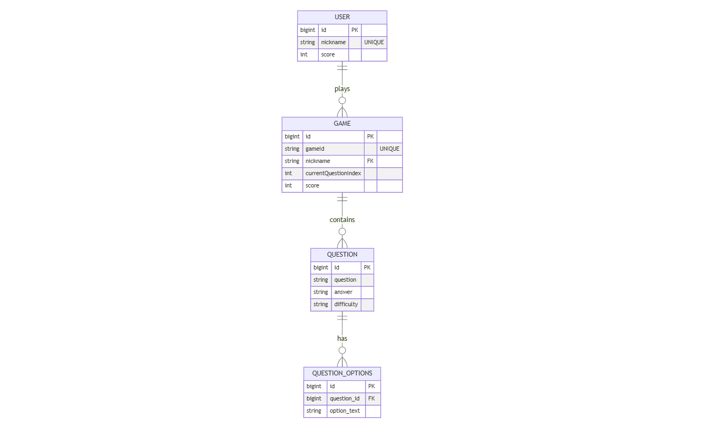

# CS 지식 퀴즈
## cs-quiz-backend

### 📌 주요 기능
#### 게임 관리
- 사용자가 게임을 시작하고 종료할 수 있음

- 게임 중 문제를 출제하고 정답을 확인할 수 있음

- 게임 종료 시 최종 점수를 계산하여 저장

#### 문제 관리
- 난이도(쉬움, 보통, 어려움)에 따라 문제를 조회할 수 있음

- 게임 시작 시 선택한 난이도에 맞는 문제를 랜덤으로 출제

#### 랭킹 관리
- 게임 종료 후 사용자 점수를 저장

- 전체 사용자의 점수를 기준으로 랭킹을 정렬하여 제공

## 📌 ERD (Entity Relationship Diagram)

## 📌 API 정리
### 게임 API
| HTTP Method | Endpoint                   | Request Body               | Response Body                      | Description          |
|------------|---------------------------|----------------------------|-------------------------------------|----------------------|
| POST       | `/api/game/start`         | `{ "nickname": "string", "difficulty": "string" }` | `{ "gameId": "string" }`           | 게임 시작 (새 게임 생성) |
| GET        | `/api/game/{gameId}/questions` | -                          | `[ { "questionId": long, "question": "string", "options": ["string"] } ]` | 게임의 문제 목록 조회 |
| POST       | `/api/game/{gameId}/answer` | `{ "questionId": long, "answer": "string" }` | `{ "correct": boolean }` | 정답 확인 |
| POST       | `/api/game/{gameId}/end`   | -                          | `{ "message": "string", "finalScore": int }` | 게임 종료 및 최종 점수 반환 |
| GET        | `/api/game/{gameId}/next`  | -                          | `{ "questionId": long, "question": "string", "options": ["string"] }` | 다음 문제 조회 |

### 문제 API
| HTTP Method | Endpoint            | Request Body | Response Body | Description     |
|------------|--------------------|--------------|--------------|----------------|
| GET        | `/api/questions`   | -            | `[ { "questionId": long, "question": "string", "options": ["string"], "answer": "string", "difficulty": "string" } ]` | 전체 문제 목록 조회 |

### 사용자 API
| HTTP Method | Endpoint         | Request Body | Response Body | Description      |
|------------|-----------------|--------------|--------------|----------------|
| GET        | `/api/users/ranking` | -            | `[ { "id": long, "nickname": "string", "score": int } ]` | 점수 순으로 유저 랭킹 조회 |

### 설명
1. 게임 API

- startGame: 게임 시작 시 닉네임과 난이도를 입력하면 gameId를 반환.

- getQuestionByGame: 특정 gameId의 문제 목록을 조회.

- checkAnswer: 사용자가 선택한 답이 맞았는지 확인.

- finishGame: 게임 종료 후 최종 점수 반환.

- getNextQuestion: 현재 게임의 다음 문제 조회.

2. 문제 API
- getAllQuestions: 모든 문제를 조회.

3. 사용자 API
- getRanking: 점수 순으로 정렬된 사용자 랭킹을 조회.